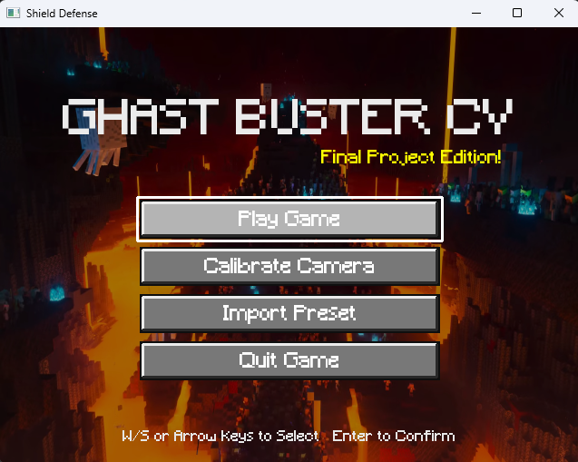
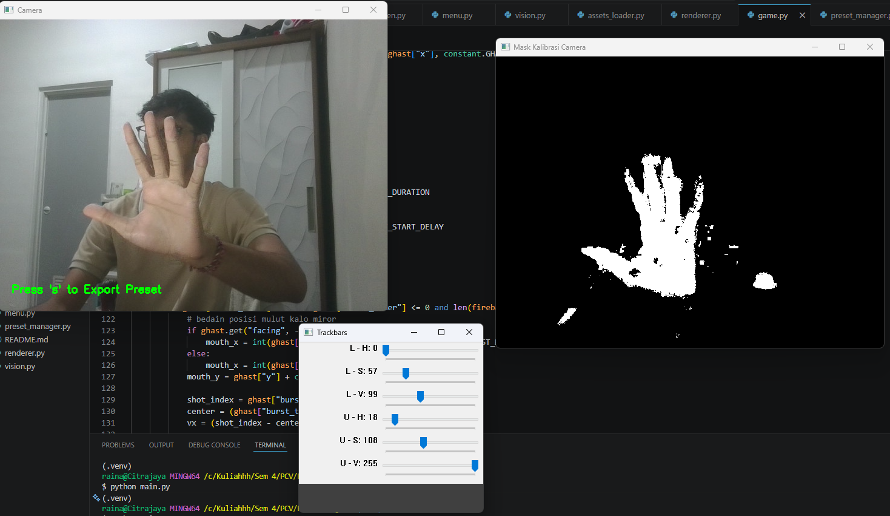
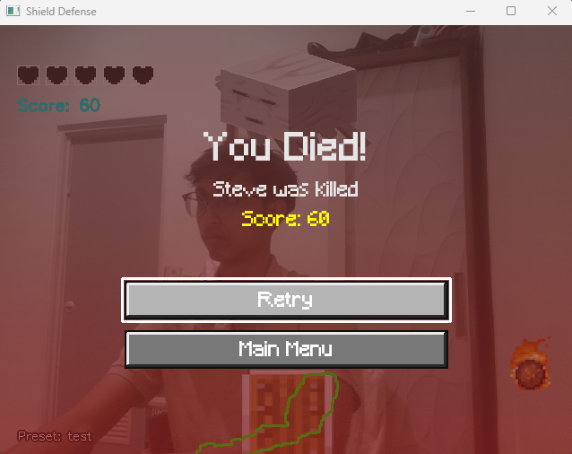

# Ghast Buster CV


## Description

A computer vision-based mini-game inspired by Minecraft mechanics, built entirely using **OpenCV** and **NumPy**.

*This project was developed to fulfill the requirements of the **Computer Vision** course taught by `Arta Kusuma Hernanda, B.S., M.S.`*

> **Name**: Anak Agung Ngurah Agung Kresna Ananta  
> **Department**: Computer Engineering  
> **NRP**: 5024241085

## Main Features

- **Real-time hand tracking based on Computer Vision** using HSV color segmentation, morphological operations, contour detection, and image moments.
- **Camera calibration system** for creating HSV presets that match the player's lighting conditions.
- **Preset import system** so the player can select an HSV profile before entering the game.
- **Shield control via webcam**: the shield position follows the detected hand centroid.
- **Ghast enemy behavior** with idle animation, shooting state, randomized movement, sprite mirroring, and burst fireballs.
- **Collision detection** between the shield and fireballs using Euclidean distance.
- **HP, scoring, countdown, main menu, and death screen** as a complete gameplay loop.
- **Manual alpha blending** for rendering transparent sprites using NumPy and OpenCV.
- **Audio feedback** using `pygame.mixer` only as an audio subsystem, not as a game engine.

> Note: `pygame.mixer` is used only to play music and sound effects. Rendering, input loop, gameplay, and Computer Vision are still handled with OpenCV, NumPy, and manual code.

## Project Structure

```text
ghast-buster-cv/
├── assets/                 # Game visual and audio assets
│   ├── fonts/              # Pixel-style font assets
│   └── sound/              # Music and sound effects
├── docs/                   # Documentation media and progress notes
│   ├── screenshots/        # Game screenshots and demo video
│   └── PROGRESS.md         # Development progress checklist
├── preset/                 # Exported HSV calibration presets
├── assets_loader.py        # Loads image, GIF, font, and other visual assets
├── audio_manager.py        # Handles music and sound effects with pygame.mixer
├── calibrateCam.py         # HSV camera calibration and preset export tool
├── constant.py             # Global configuration, paths, sizes, and gameplay values
├── death_screen.py         # Death screen UI and input handling
├── game.py                 # Gameplay state, Ghast logic, fireballs, collision, HP, and score
├── main.py                 # Main entry point and application state loop
├── menu.py                 # Main menu UI and input handling
├── preset_manager.py       # HSV preset import logic
├── renderer.py             # Rendering helpers for sprites, HUD, effects, and countdown
├── vision.py               # Computer Vision hand detection pipeline
└── README.md               # Project report and technical guide
```

## Installation Guide

### 1. Clone the Repository

```bash
git clone https://github.com/Kresnananta/ghast-buster-cv.git
cd ghast-buster-cv
```

### 2. Create a Virtual Environment

Python 3.11 is recommended because dependencies such as `pygame` are more stable on this version.

```bash
py -3.11 -m venv .venv
```

Activate the virtual environment:

```bash
.venv\Scripts\activate
```

If successful, the terminal will show this prefix:

```text
(.venv)
```

### 3. Upgrade pip

```bash
python -m pip install --upgrade pip
```

### 4. Install Dependencies

```bash
python -m pip install opencv-python numpy pillow pygame
```

### 5. Run the Game

```bash
python main.py
```

## How to Play

### Main Menu

When the program starts, the player will enter the main menu.

Available menus:

- **Play Game**: starts the game.
- **Calibrate Camera**: opens the HSV calibration tool.
- **Import Preset**: selects an HSV preset from the `preset/` folder.
- **Quit Game**: exits the program.

Menu navigation:

```text
W / Arrow Up     : move selection up
S / Arrow Down   : move selection down
Enter            : select menu
Q                : quit
```

### Camera Calibration

Calibration is needed when lighting conditions change or when the hand is difficult to detect.

Steps:

1. Select **Calibrate Camera** from the main menu.
2. Adjust the HSV sliders until the hand appears white in the mask window.
3. Press `S` to export the preset.
4. Save the `.json` file into the `preset/` folder.
5. Press `Q` to return to the main menu.

### Import Preset

1. Select **Import Preset** from the main menu.
2. Select a `.json` file from the calibration result.
3. The active preset name will appear in the bottom-left corner during gameplay.

### Gameplay

1. Select **Play Game**.
2. Wait for the 3-second countdown.
3. Move your hand in front of the camera to control the shield.
4. Deflect the fireballs shot by the Ghast.
5. Score increases when a fireball is successfully deflected.
6. HP decreases when a fireball gets through.
7. When HP reaches zero, the death screen will appear.

Controls during gameplay:

```text
Q : exit the game
```

Death screen:

```text
W / Arrow Up     : move selection up
S / Arrow Down   : move selection down
Enter            : select menu
Q                : quit
```

## Progress

The project development progress is separated into this file:

[View PROGRESS.md](docs/PROGRESS.md)

## Screenshots

### Main Menu



### Gameplay


### Camera Calibration



### Death Screen



## Video Demo


https://github.com/user-attachments/assets/30bc34b4-e676-4941-8de2-eb8c2495ebfc


